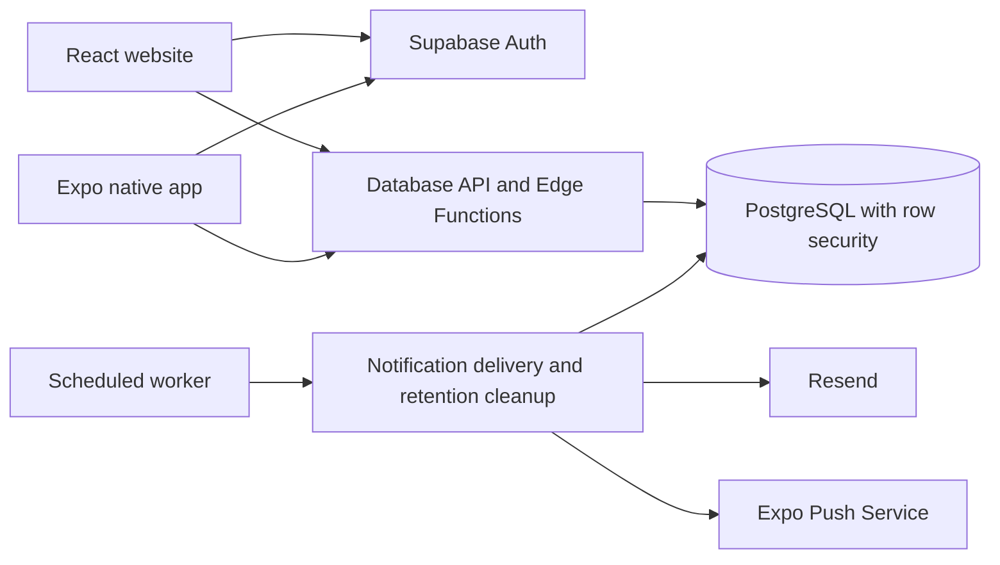

# Architecture

## Applications

The React website and Expo native app share a Supabase backend. Each application owns its presentation, navigation, session persistence, and device integrations. Database functions define common membership, learning, moderation, notification, and deletion behavior.

## Learning and item identification

Lesson completion and rewards are checked on the server. Clients cannot directly change XP or award achievements. The item identification service describes a user-selected image, then matches the description against a local mirror of official Delaware DNREC guidance. Disposal instructions require an official match. Images are not collected for a feedback or training workflow.

## Communities and classrooms

Students and teachers select their account type during registration. Teacher status permits creating managed spaces; it does not grant access to unrelated communities. Community owners, managers, classroom teachers, and ordinary members have distinct capabilities. Invite codes establish memberships, and rotation invalidates earlier codes.

Administrators are assigned separately. Global administrative privileges require a verified TOTP session. Both clients offer enrollment, challenge verification, and backup authenticator setup.

Deleting a community or classroom sets its archive timestamp and a seven-day deletion deadline. Active views, membership checks, assignments, invitation handling, and notification delivery exclude deleted spaces. Owners and authorized administrators can restore a space before its deadline. Restoring a community includes its active classrooms; classrooms deleted separately retain their own deadlines. Expired records are permanently removed by the scheduled worker. Account deletion also permanently removes recoverable spaces owned by that account.

## Notifications and background work

Database triggers create a private inbox for assignments, announcements, and events. The scheduled worker generates streak and due-date reminders, removes expired spaces, and leases pending delivery jobs. Delivery rechecks membership, content visibility, opt-in preferences, and destination ownership. Provider acceptance and push receipts are tracked separately. Email and lock-screen text contain no private classroom content.

## Repository boundaries

Production applications live under `apps/`. The Supabase migration directory is the canonical database history. `legacy/` contains earlier prototypes and is excluded from current builds and CI. Generated bundles, local environments, personal release notes, store submission instructions, and local agent instructions are excluded from version control.
